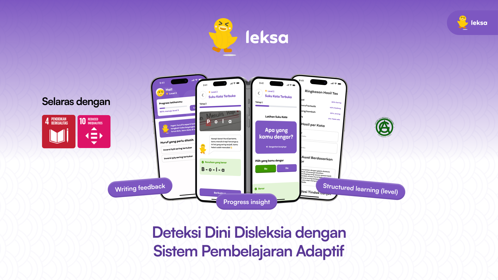

# `leksa`

**Platform Deteksi Dini Disleksia dengan Sistem Pembelajaran Adaptif**

---

## Team

| **Name**                    | **Role**                                 |
|-----------------------------|------------------------------------------|
| Nauval Yusriya Athallah | Lead, Hacker  |
| Nabiel Muhamad Irfani      | Hustler                      |
| Muhammad Karov Ardava Barus               | Hacker                           |
| Casta Garneta              | Hipster                           |
| Thoriq Abdurrohman Taqy              | Hacker                           |

---

## 1. Masalah: "The Identification Vacuum" di Indonesia
Di Indonesia, diperkirakan terdapat lebih dari **5 juta anak dengan disleksia**, namun **80% di antaranya tidak terdiagnosis** secara resmi. Hambatan utama meliputi biaya diagnosis psikolog yang mahal dan minimnya tenaga ahli di daerah. **LEKSA** hadir untuk mendemokrasi akses deteksi dini melalui infrastruktur teknologi yang inklusif.

## 2. Solusi: Vision-Transformer & Intervensi Adaptif
**LEKSA** adalah solusi *web-based* premium yang menggabungkan psikologi pendidikan dengan teknologi AI termutakhir:
*   **Physical-to-Digital Pipeline:** Anak tetap menulis di media kertas untuk menjaga perkembangan motorik halus, sementara AI menangkapnya melalui visi komputer (kamera).
*   **Handwriting Transformer (SOTA):** Menggunakan model **TrOCR** (Transformer-based OCR) yang dilatih khusus untuk mengenali tulisan tangan yang tidak beraturan.
*   **Privacy-First Architecture:** Semua proses inferensi AI dan database berjalan di jaringan lokal (Edge Computing), menjamin data sensitif anak tidak pernah dikirim ke cloud.

## 3. Tech Stack & Engineering Excellence
Kami menggunakan arsitektur monorepo yang dioptimasi untuk performa laptop *high-end* (ROG Zephyrus):

| Komponen | Teknologi | Peran |
| :--- | :--- | :--- |
| **Frontend** | **Next.js 14** | UI/UX Premium dengan interaksi *real-time* dan animasi dinamis. |
| **Backend** | **FastAPI** | REST API asinkron dengan *concurrency* tinggi untuk pengolahan gambar. |
| **OCR Engine** | **TrOCR (Vision-Transformer)** | Model AI SOTA (Microsoft/trocr-base) untuk pengenalan tulisan tangan. |
| **Fuzzy Engine** | **RapidFuzz** | Algoritma *string matching* untuk toleransi kesalahan tulis ringan. |
| **Database** | **SQLite (Local DB)** | Penyimpanan sesi lokal dengan latensi rendah. |

## 4. Fitur Utama

### A. Progressive Screening (5-Level Curriculum)
*   **Level 1 (Huruf Tunggal):** Deteksi awal pengenalan karakter visual (e.g. 'A').
*   **Level 2 (Suku Kata):** Menguji penggabungan konsonan-vokal (e.g. 'BA').
*   **Level 3 (Suku Kata Kompleks):** Deteksi inversi dan omisi (e.g. 'BAN').
*   **Level 4-5 (Kata & Morfologi):** Analisis kelancaran penulisan kata utuh (e.g. 'NYALA', 'MENEMANI').

### B. Interactive Listen Card
Antarmuka "Dengarkan-Lalu-Tulis" yang intuitif dengan *feedback* visual untuk membantu fokus anak (kartu berubah warna saat audio diputar).

### C. Comprehensive Result Summary
*   **Risk Score Analysis:** Memberikan skor risiko 0-100 berdasarkan akurasi visi komputer.
*   **Error Pattern Recognition:** Mendeteksi pola *reversal* (huruf terbalik seperti b/d, p/q) secara otomatis menggunakan AI.
*   **Learning Roadmaps:** Merekomendasikan Level latihan **LEKSA** (1-5) yang harus diikuti anak berdasarkan hasil skrining.

### D. Mode Belajar Adaptif (Learning Mode)
* **Orton-Gillingham Curriculum:** Latihan berlevel (1-5) mulai dari pengenalan huruf konfusable (b/d, p/q) hingga morfologi kata.
* **Dynamic Feedback:** Sistem memberikan *feedback* langsung berdasarkan benar/salahnya jawaban anak dan menyesuaikan level secara otomatis.

## 5. Cara Menjalankan (Local Development)

### Backend:
1. `cd BE`
2. `pip install -r requirements.txt`
3. `uvicorn app.main:app --reload --port 8000`

### Frontend:
1. `cd FE`
2. `npm install`
3. `npm run dev`
